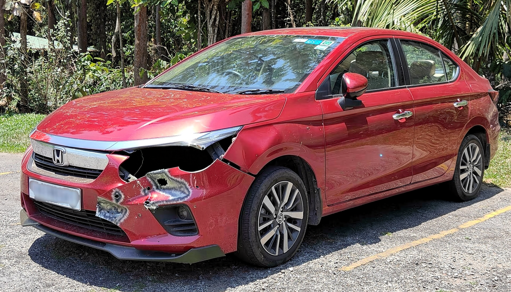

# LanPaint-Diffusers

Training-free diffusion inpainting and outpainting with [LanPaint](https://github.com/scraed/LanPaint), built on [Hugging Face Diffusers](https://github.com/huggingface/diffusers).

## Features

- **Streamlit UI** — upload an image, paint the edit region with a brush, and generate. No command line needed.
- **Reference image support** — pass a second image as visual inspiration for Flux2 Klein (style, texture, damage reference, etc.)
- **Diffusers-native** — uses the `diffusers` library only. No ComfyUI or other graph-based UI dependency.
- **Multi-model** — one UI, one CLI, and one pipeline API for all supported backends:
  - **Flux2 Klein** (`flux-klein`) — edit-style, supports reference images
  - **Z-Image Turbo** (`z-image`)
  - **Stable Diffusion 3** (`sd3`)
  - **Qwen Image Edit** (`qwen`) — thanks [@spartanz51](https://github.com/spartanz51)
- **Extensible** — new backends are integrated via the adapter registry (one entry in `registry.py`).

---

## Installation

### Requirements

- Python 3.10+ (3.13 tested)
- NVIDIA GPU with CUDA support
- [uv](https://docs.astral.sh/uv/) — recommended package manager

### Quick start with `uv` (recommended)

```bash
git clone https://github.com/your-org/LanPaint-diffusers.git
cd LanPaint-diffusers

# Install uv (if not already installed)
curl -LsSf https://astral.sh/uv/install.sh | sh

# Create venv and install all dependencies
uv sync
```

### cuDNN version mismatch (Jetson / ARM64)

On NVIDIA Jetson (or any ARM64 system with a system-installed cuDNN), PyTorch and the
system cuDNN may disagree on the sub-library version, producing:

```
RuntimeError: CUDNN_BACKEND_TENSOR_DESCRIPTOR ... CUDNN_STATUS_SUBLIBRARY_VERSION_MISMATCH
```

The fix is already applied in `pyproject.toml` — `uv` pins `nvidia-cudnn-cu13` to match
the system version:

```toml
[tool.uv]
override-dependencies = ["nvidia-cudnn-cu13==9.21.1.3"]
```

Change `9.21.1.3` to match your installed cuDNN version (`dpkg -l | grep cudnn`), then re-run `uv sync`.

### Alternative: pip + venv

```bash
python -m venv .venv
source .venv/bin/activate      # Windows: .venv\Scripts\activate
pip install --upgrade pip
pip install -r requirements.txt
```

### Verify

```bash
uv run python -c "import torch, diffusers, LanPaint; print(torch.__version__, diffusers.__version__)"
uv run python run_lanpaint.py --list-models
```

---

## Model paths — `config.toml`

Model paths are configured in `config.toml` at the project root.
Set `path` to a local directory or HuggingFace Hub ID.
Leave `path` empty to use the default Hub ID from the registry.

```toml
[models.flux-klein]
path = "/path/to/FLUX.2-klein-4B/snapshots/..."
local_files_only = true

[models.sd3]
path = ""          # downloads from Hub on first run
local_files_only = false

[models.z-image]
path = ""
local_files_only = false

[models.qwen]
path = ""
local_files_only = false
```

The Streamlit UI reads this file on startup and pre-fills the model path field automatically.

---

## Streamlit UI

The UI is the recommended way to use LanPaint. It provides image upload, interactive
mask painting, reference image support, and a live output panel — no CLI required.

### Launch

```bash
uv run streamlit run app.py
# or, without uv:
streamlit run app.py
```

Open `http://localhost:8501` in your browser.

### Workflow

1. **Sidebar → Load model** — select a model, confirm the path, click **🚀 Load model**.  
   The model is cached; reloading is only needed when switching models.

2. **Upload image** — drag-and-drop or browse for the source image (PNG, JPEG, WebP).

3. **Paint the mask** — use the red brush to paint over the region you want to edit.  
   Unpainted areas are preserved. Use the **Brush size** slider and **🗑 Clear mask** button as needed.

4. **Reference image (optional, Flux only)** — expand the **📎 Reference image** panel below
   the canvas and upload a second image. The model uses it as visual context alongside your prompt.

5. **Enter a prompt** — describe the desired edit in the right panel.

6. **Generate** — click **✨ Generate**. The result appears below with elapsed time and a download button.

### UI layout

```
┌─ Sidebar ────────────────────┐  ┌─ Main ──────────────────────────────────────┐
│ Model selection              │  │                                              │
│ Model path / Hub ID          │  │  ┌─ Left column ─────┐  ┌─ Right column ──┐ │
│ Local files only             │  │  │ Image upload       │  │ Prompt          │ │
│ 🚀 Load model                │  │  │ Mask canvas        │  │ Negative prompt │ │
│                              │  │  │ 📎 Reference image │  │ ✨ Generate     │ │
│ Guidance scale               │  │  └───────────────────┘  │ Result + DL     │ │
│ Inference steps              │  │                          └─────────────────┘ │
│ Seed                         │  └──────────────────────────────────────────────┘
│ ▸ Advanced · LanPaint        │
└──────────────────────────────┘
```

---

## CLI usage

The CLI (`run_lanpaint.py`) provides full access to all models and parameters without the UI.

**We recommend using `run_lanpaint.sh` as a starting point.** Uncomment the block you need, then:

```bash
uv run bash run_lanpaint.sh
# or:
bash run_lanpaint.sh    # if your venv is activated
```

### Basic syntax

```bash
# Inpaint
uv run python run_lanpaint.py \
    --model flux-klein \
    --prompt "change building's window light color to blue" \
    --image path/to/image.png \
    --mask path/to/mask.png

# Outpaint (generates mask from padding spec — do not pass --mask)
uv run python run_lanpaint.py \
    --model z-image \
    --prompt "extend the scene" \
    --image path/to/image.png \
    --outpaint-pad l200r200t200b200

# List available models
uv run python run_lanpaint.py --list-models
```

### Key options

| Option | Description |
|--------|-------------|
| `--model` | Model key: `flux-klein`, `sd3`, `z-image`, `qwen` |
| `--model-id` | Override Hub ID or local checkpoint path |
| `--local-files-only` | Disable Hub downloads |
| `--prompt` | Edit instruction |
| `--negative-prompt` | What to avoid |
| `--image` | Source image (path or URL) |
| `--mask` | Mask image — black=edit, white=keep (path or URL) |
| `--outpaint-pad` | Outpaint padding spec e.g. `l200r200t200b200` |
| `--guidance-scale` | CFG scale (model default if omitted) |
| `--num-steps` | Inference steps (model default if omitted) |
| `--seed` | Random seed (default: 0) |
| `--output` / `-o` | Output path (default: `results/<model>/lanpaint_output.png`) |
| `--save-preprocess-dir` | Save preprocessed network inputs for debugging |

### LanPaint hyper-parameters

| Option | Default | Description |
|--------|---------|-------------|
| `--lp-n-steps` | 2 | Langevin steps per scheduler step |
| `--lp-friction` | 15.0 | Friction |
| `--lp-lambda` | 8.0 | Lambda (λ) |
| `--lp-beta` | 1.0 | Beta (β) |
| `--lp-step-size` | 0.2 | Step size |
| `--lp-early-stop` | 1 | Scheduler steps at end to skip Langevin |
| `--lp-blend-overlap` | 9 | Smooth-mask blend overlap pixels |

---

## Mask convention

Both the CLI and the UI follow the same convention:

| Pixel value | Meaning |
|-------------|---------|
| **Black (0)** / alpha 0 | Region to **edit** (inpaint area) |
| **White (255)** / alpha 255 | Region to **keep** (unchanged) |

Accepted formats: grayscale (`L`), RGB (converted to grayscale internally), or RGBA
(alpha channel used when any pixel has alpha < 250).

In the Streamlit UI: areas you **paint red** become the edit region (black in the mask).
Unpainted areas are kept.

---

## Reference image (Flux2 Klein)

Flux2 Klein supports passing a second image as visual context at inference time.
Both images are packed together in a single `prepare_image_latents` call so they receive
non-overlapping 3D positional coordinates — the model can distinguish and attend to each image.

The reference image is used as extra context tokens in the transformer at every denoising
step. It does not affect the mask, the LanPaint Langevin loop, or the final blend — only
what the model generates inside the masked region.

### Prompting with a reference image

Refer to images by position: `image1` = source, `image2` = reference.

```
Generate broken headlamp on image1 at the black region.
Use the damage style shown in image2 as reference.
Do not change the color of the car in image1.
Do not generate damage outside the black region of image1.
```

```
Replace the masked area of image1 with a cracked bumper.
Match the scratch depth and texture visible in image2.
Preserve all other parts of image1 unchanged.
```

**General pattern:**

```
[What to generate] on image1 [where].
[How to use image2].
Do not change [what to preserve] in image1.
```

### Python API

```python
from lanpaint_pipeline import LanPaintConfig, LanPaintInpaintPipeline
from lanpaint_pipeline.registry import create_adapter
from PIL import Image

adapter = create_adapter("flux-klein", device="cuda", model_id="/path/to/checkpoint",
                         local_files_only=True)
pipeline = LanPaintInpaintPipeline(adapter)

source = Image.open("car.jpg")
mask   = Image.open("mask.png")   # black=edit, white=keep
ref    = Image.open("damage.jpg") # reference

result = pipeline(
    prompt="Generate broken headlamp on image1. Use damage from image2.",
    image=source,
    mask_image=mask,
    ref_images=[ref],             # list — one or more reference images
    guidance_scale=5.0,
    num_inference_steps=20,
    seed=42,
)
result.images[0].save("output.png")
```

---

## Library structure

```
LanPaint-diffusers/
├── app.py               # Streamlit UI
├── config.toml          # Model paths (edit to set local checkpoints)
├── pyproject.toml       # Dependencies (uv / pip)
├── requirements.txt     # Legacy pip requirements
├── run_lanpaint.py      # Unified CLI
├── run_lanpaint.sh      # Ready-to-run CLI examples
└── lanpaint_pipeline/
    ├── __init__.py
    ├── model_adapter.py   # Abstract adapter interface
    ├── pipeline.py        # LanPaintInpaintPipeline (orchestrator)
    ├── registry.py        # Model registry + built-in registrations
    ├── utils.py           # Blend, time helpers, image loading
    └── adapters/
        ├── __init__.py
        ├── flux_klein.py  # Flux2KleinAdapter  (+ reference image support)
        ├── qwen.py        # QwenAdapter
        ├── sd3.py         # SD3Adapter
        └── z_image.py     # ZImageAdapter
```

**Key components:**

- **`LanPaintInpaintPipeline`** (`pipeline.py`) — model-agnostic flow: preprocess → encode → LanPaint Langevin + scheduler loop → decode → smooth blend.
- **`ModelAdapter`** (`model_adapter.py`) — abstract interface (`encode_prompt`, `encode_and_prepare`, `mask_to_latent_space`, `prepare_timesteps`, `predict_x0`, `decode_latents`). Each backend implements one adapter.
- **Registry** (`registry.py`) — maps model keys to pipeline class, adapter class, and default config. Adding a model = one `register_model(...)` call.

---

## Results showcase

### Flux2 Klein (Example 24)

| Original | Masked | Diffusers | ComfyUI |
|:--------:|:------:|:---------:|:-------:|
|  |  |  |  |

### Z-Image Turbo (Example 21)

| Original | Masked | Diffusers | ComfyUI |
|:--------:|:------:|:---------:|:-------:|
|  |  |  |  |

### Qwen Image Edit (Example 14)

| Original | Masked | Diffusers | ComfyUI |
|:--------:|:------:|:---------:|:-------:|
|  |  |  |  |

---

## Credits & original authors

This repository is a **Diffusers wrapper** around the following original works. All
credit for the underlying algorithms and model weights belongs to their respective authors.

### LanPaint algorithm

> Candi Zheng, Yuan Lan, Yang Wang — *LanPaint: Training-Free Diffusion Inpainting with
> Asymptotically Exact and Fast Conditional Sampling*, TMLR 2025.

| | |
|---|---|
| Paper | <https://openreview.net/forum?id=JPC8JyOUSW> |
| Code | <https://github.com/scraed/LanPaint> |

LanPaint provides the Langevin-dynamics sampling core that makes training-free inpainting
possible. This repository wraps it in a Diffusers-compatible pipeline.

### Diffusers

> The HuggingFace team — *Diffusers: State-of-the-art diffusion models*.

| | |
|---|---|
| Repo | <https://github.com/huggingface/diffusers> |
| Docs | <https://huggingface.co/docs/diffusers> |

### Model weights

| Model key | Name | Authors | Repository / Hub |
|-----------|------|---------|-----------------|
| `flux-klein` | FLUX.2 Klein 4B | Black Forest Labs | [black-forest-labs/FLUX.2-klein-base-9B](https://huggingface.co/black-forest-labs/FLUX.2-klein-base-9B) |
| `sd3` | Stable Diffusion 3 Medium | Stability AI | [stabilityai/stable-diffusion-3-medium-diffusers](https://huggingface.co/stabilityai/stable-diffusion-3-medium-diffusers) |
| `z-image` | Z-Image Turbo | Tongyi-MAI (Alibaba) | [Tongyi-MAI/Z-Image-Turbo](https://huggingface.co/Tongyi-MAI/Z-Image-Turbo) |
| `qwen` | Qwen Image Edit | Qwen Team (Alibaba) | [Qwen/Qwen-Image-Edit-2509](https://huggingface.co/Qwen/Qwen-Image-Edit-2509) |

### Contributors

- **[@spartanz51](https://github.com/spartanz51)** — Qwen Image Edit adapter and CPU-offload compatibility fix.

---

## Citation

If you use this repository or LanPaint in your work, please cite:

```bibtex
@article{zheng2025lanpaint,
  title   = {LanPaint: Training-Free Diffusion Inpainting with Asymptotically Exact and Fast Conditional Sampling},
  author  = {Candi Zheng and Yuan Lan and Yang Wang},
  journal = {Transactions on Machine Learning Research},
  issn    = {2835-8856},
  year    = {2025},
  url     = {https://openreview.net/forum?id=JPC8JyOUSW},
}
```
